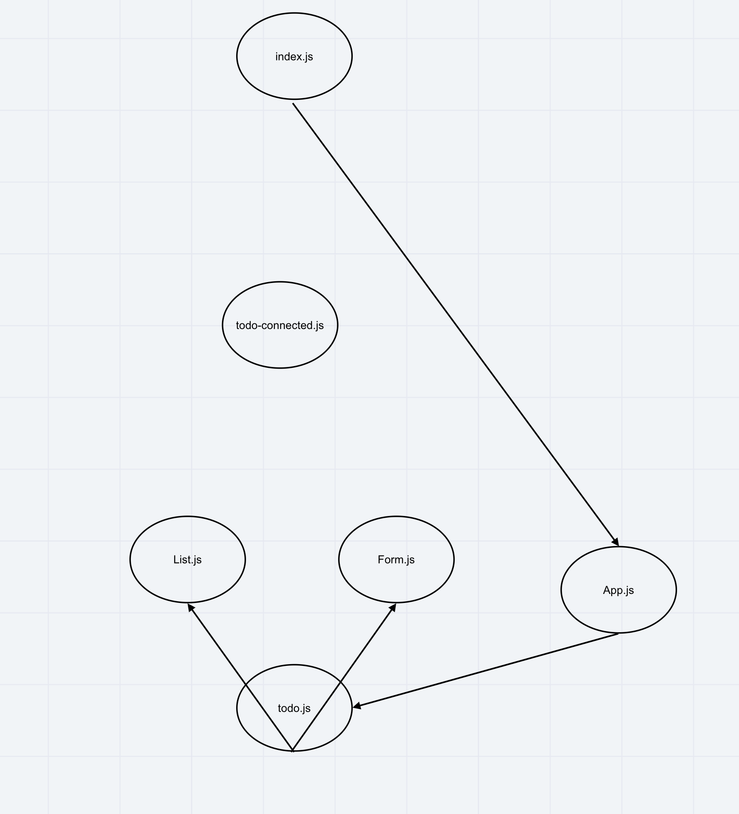

# LAB - `<Login /> and <Auth />`

## Author: Emad Idris

[Netlify Status](https://pedantic-lalande-215f39.netlify.app/todo-app/)

## todo Phase 1:

Today, we begin the first of a 4-phase build of the To Do List Manager, a web-based task manager application, written in React. In this first phase, our goal is to setup a foundational system using React hooks that we can build upon in later phases, adding databases, logins, and more advanced features.

The following user/developer stories detail the major functionality for this phase of the project.

- As a user, I would like an easy way to add a new to do item using an online interface

- As a user, I would like my to do items to have an assignee, due date, difficulty meter, status and the task itself

- As a user, I would like to delete to do items that are no longer needed

- As a user, I would like to easily mark to do items as completed

- As a user, I would like to edit an existing to do item

## todo Phase 2:

In Phase 2, we’re going to connect the To Do Manager to a deployed API, backed by a database. The core functionality and stories do not change (reference Phase 1), but a new one has been added to note this shift in persistence.

- As a user, I would like to be able to add, update, and delete To Do items

- As a user, I would like my To Do Items to be permanently stored so that I can re-access them at any time, using any device

Note that the display of each To Do item has changed slightly.

## todo Phase 3:

In Phase 3, we’d like to extend the functionality of the application by potentially allowing users to set a few configuration options to change how the application behaves. The user stories from Phases 1 and 2 remain unchanged. For this phase, we are now adding the following new user stories.

- As a user, I would like to see my To Do List Items a few at a time so that I don’t have to wade through them all

- As a user, I would like my default view to only be “Incomplete” Items so that I can quickly determine what I have to do.

- As a user, I would like my list sorted by difficulty so that I can more easily prioritize

- As a user, I would like the option to change my default preferences with regards to how many Items I see per page, which items are filtered, and how they are sorted

## todo Phase 4:

In Phase 4, we’d like to extend the functionality of the application by requiring users be logged in to view items and also restrict access based on user type. The user stories from Phases 1, 2 and 3 remain unchanged. For this phase, we are now adding the following new user stories.

- As a user, I want to provide a way for other users to create new accounts

- As a user, I want to provide a way for all users to login to their account

- As a user, I want to make sure that my To Do items are only viewable to users that have logged in with a valid account.

- As a user, I want to ensure that only fellow users that are allowed to “create”, based on their user type, can add new To Do Items

- As a user, I want to ensure that only fellow users that are allowed to “update”, based on their user type, can mark To Do Items complete

- As a user, I want to ensure that only fellow users that are allowed to “delete”, based on their user type, can delete new To Do Items

